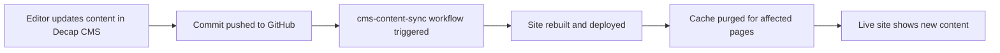

# Caching Strategy for Litecky Editing Services

## Overview

This document outlines the two-phase caching strategy implemented for the Litecky Editing Services website, deployed on Cloudflare Pages with Decap CMS for content management.

## Current Status: Phase 1 - Early Production

We are currently in **Phase 1 (Early Production)**, prioritizing content freshness and immediate updates over aggressive caching.

### Phase 1 Configuration

**Goal**: Ensure all CMS changes are immediately visible on the live site.

**Implementation**:
1. **Default Cache Headers** (`public/_headers`):
   - HTML pages: `Cache-Control: public, max-age=0, must-revalidate`
   - Admin panel: `Cache-Control: no-store` (never cached)
   - Versioned assets: `Cache-Control: public, max-age=31536000, immutable`
   - Media files: `Cache-Control: public, max-age=3600` (1 hour)

2. **Automated Deployment Pipeline** (`.github/workflows/cms-content-sync.yml`):
   - Triggers automatically when content files change
   - Builds and deploys to Cloudflare Pages
   - Performs targeted cache purging for updated pages

3. **Cache Purging Strategy**:
   - Content changes trigger immediate deployment
   - Selective URL purging for modified pages
   - Emergency "Purge Everything" available via workflow dispatch

### How CMS Updates Flow to Production



## Phase 2: Production Performance (Future)

When the site content stabilizes and performance becomes the priority, we'll transition to Phase 2.

### Phase 2 Configuration (Planned)

**Goal**: Maximize cache hit ratio and performance while maintaining content freshness.

**Implementation**:
1. **Cloudflare Cache Rules**:
   - Immutable assets: Edge TTL 1 year, Browser TTL 1 year
   - Media content: Edge TTL 1 month, Browser TTL 1 week
   - HTML pages: Edge TTL 4 hours, Browser TTL 5 minutes
   - Admin panel: Bypass cache entirely

2. **Advanced Cache Purging**:
   - Worker endpoint for granular cache control (`workers/cache-purge/`)
   - Support for URL, prefix, and tag-based purging
   - Secure API with authentication

3. **Cache Tags** (Future Enhancement):
   - Tag content by author, category, date
   - Enable logical group purging

## Required Environment Variables

### GitHub Secrets
- `CLOUDFLARE_API_TOKEN`: API token with Zone:Cache Purge:Purge permission
- `CLOUDFLARE_ACCOUNT_ID`: Your Cloudflare account ID
- `CLOUDFLARE_ZONE_ID`: Zone ID for liteckyeditingservices.com

### Cloudflare Worker Secrets (Phase 2)
- `CLOUDFLARE_API_TOKEN`: Same as above
- `CLOUDFLARE_ZONE_ID`: Same as above
- `PURGE_SECRET`: Shared secret with GitHub Actions

## Monitoring and Validation

### Key Metrics to Track
1. **Cache Hit Ratio**: Monitor in Cloudflare Analytics
2. **Response Times**: Track Core Web Vitals
3. **Deployment Success Rate**: Check GitHub Actions logs

### Validation Commands

```bash
# Check current cache headers
curl -I https://liteckyeditingservices.com

# Verify specific page caching
curl -I https://liteckyeditingservices.com/services/

# Test cache status
# Look for CF-Cache-Status header: HIT, MISS, EXPIRED, or BYPASS
```

## Troubleshooting

### Content not updating after CMS change

1. **Check GitHub Actions**: Verify `cms-content-sync` workflow ran successfully
2. **Manual purge**: Use workflow dispatch with `purge_type: all`
3. **Verify deployment**: Check Cloudflare Pages dashboard for latest deployment

### Cache not working as expected

1. **Check headers**: Use browser DevTools Network tab
2. **Verify _headers file**: Ensure it's properly formatted
3. **Test with curl**: `curl -I <url>` to see raw headers

## Emergency Procedures

### Manual Cache Purge (via Cloudflare Dashboard)

1. Navigate to Caching > Configuration
2. Click "Purge Everything" (use sparingly)
3. Wait 30 seconds for global propagation

### Force Rebuild and Deploy

```bash
# Trigger manual workflow
gh workflow run cms-content-sync -f purge_type=all
```

## Migration Checklist: Phase 1 → Phase 2

When ready to transition to Phase 2:

- [ ] Content update frequency has stabilized to < 5 updates/day
- [ ] All major content sections are complete
- [ ] Performance metrics baseline established
- [ ] Cache purge worker deployed and tested
- [ ] Cloudflare Cache Rules configured
- [ ] Monitoring alerts set up
- [ ] Team trained on new workflow

## References

- [Cloudflare Pages Caching Documentation](https://developers.cloudflare.com/pages/configuration/serving-pages/)
- [Cloudflare Cache Rules](https://developers.cloudflare.com/cache/how-to/cache-rules/)
- [Decap CMS Git Gateway](https://decapcms.org/docs/backends-overview/)
- [Cache Purge API](https://developers.cloudflare.com/api/operations/zone-purge)