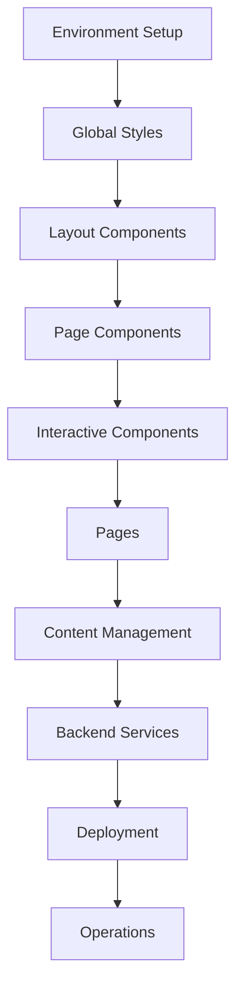

# IMPLEMENTATION ROADMAP - Litecky Editing Services
## Logical Build Order & Dependencies

Last Updated: September 22, 2025 (17:00)

---

## 📊 Documentation Analysis Complete

### Files Read (4/15 - 27%)
1. ✅ project-document.md (1355 lines) - Core project specs
2. ✅ production-files.md (870 lines) - Production implementations
3. ✅ cloudflare-deployment.md (1310 lines) - Full deployment config
4. ✅ deployment-config.md (500 lines) - Deployment details

### Files Partially Read (1/15 - 7%)
5. ⚠️ decap-cms-setup.md (200/750 lines) - CMS configuration

### Files Not Read (10/15 - 66%)
6. ❌ code-quality-setup.md (944 lines)
7. ❌ secrets-env-setup.md (824 lines)
8. ❌ operations-reliability.md (1048 lines)
9. ❌ documentation.md (1432 lines)
10. ❌ policy-as-code.md (967 lines)
11-15. ❌ All .clinerules files (5 files)

---

## 🎯 CRITICAL: Implementation Order

### Phase 1: Foundation (Current)
**Must complete before anything else works**

1. **Core Structure** ✅
   - [x] Git repository initialized
   - [x] Basic Astro project structure
   - [x] Package.json with dependencies
   - [x] Directory structure created

2. **Environment Setup** 🔄
   - [x] Tailwind CSS v4 configured
   - [ ] Environment variables (.env files)
   - [ ] TypeScript configuration
   - [ ] ESLint/Prettier setup

### Phase 2: Static Site Components (Next Priority)
**Build the visible website first**

3. **Global Styles** (from project-document.md)
   - [ ] src/styles/global.css with design tokens
   - [ ] Font integration (@fontsource)
   - [ ] CSS custom properties
   - [ ] Responsive breakpoints

4. **Layout Foundation**
   - [x] BaseLayout.astro (basic)
   - [ ] Update with SEO meta tags
   - [ ] Schema.org JSON-LD
   - [ ] Skip links for accessibility

5. **Components** (Build in this order)
   - [ ] Header.astro (navigation)
   - [ ] Footer.astro (site-wide)
   - [ ] Hero.astro (homepage focal)
   - [ ] TrustBar.astro (social proof)
   - [ ] ProcessSnapshot.astro
   - [ ] FeaturedTestimonial.astro
   - [ ] ValueProp.svelte (interactive)
   - [ ] FileUpload.svelte (forms)

6. **Pages** (After components exist)
   - [x] index.astro (skeleton only)
   - [ ] Update index with components
   - [ ] services.astro
   - [ ] process.astro
   - [ ] about.astro
   - [ ] testimonials.astro
   - [ ] faq.astro
   - [ ] contact.astro

7. **Scripts**
   - [ ] menu-toggle.js (mobile nav)

### Phase 3: Content Management
**After static site works locally**

8. **Content Collections**
   - [ ] src/content.config.ts
   - [ ] Content folders structure
   - [ ] Sample content files

9. **Decap CMS Setup**
   - [ ] public/admin/index.html
   - [ ] public/admin/config.yml
   - [ ] GitHub OAuth App creation
   - [ ] OAuth Worker deployment

### Phase 4: Backend Services
**After frontend is stable**

10. **Cloudflare Workers**
    - [ ] Decap OAuth proxy worker
    - [ ] Contact form handler
    - [ ] Document upload handler

11. **Email Integration**
    - [ ] SendGrid account setup
    - [ ] Domain authentication
    - [ ] Email templates
    - [ ] API integration

12. **Form Protection**
    - [ ] Turnstile setup
    - [ ] Client-side integration
    - [ ] Server-side validation

### Phase 5: Deployment
**After everything works locally**

13. **Cloudflare Pages**
    - [ ] Project creation
    - [ ] Environment variables
    - [ ] Build configuration
    - [ ] Custom domain setup

14. **Database & Storage**
    - [ ] D1 database creation
    - [ ] R2 bucket setup
    - [ ] KV namespace
    - [ ] Queue configuration

15. **CI/CD**
    - [ ] GitHub Actions workflows
    - [ ] Automated testing
    - [ ] Deployment pipelines

### Phase 6: Operations
**After deployed**

16. **Monitoring**
    - [ ] Analytics setup
    - [ ] Error tracking
    - [ ] Performance monitoring
    - [ ] Uptime checks

17. **Security**
    - [ ] Headers configuration
    - [ ] Rate limiting
    - [ ] CORS setup
    - [ ] CSP policy

---

## 🚨 Current Blockers

1. **Missing Core Files**:
   - global.css (required for all components)
   - menu-toggle.js (required for Header)
   - Content structure (required for CMS)

2. **Unknown Requirements**:
   - 10 documentation files not yet read
   - May contain critical dependencies

3. **External Dependencies**:
   - GitHub OAuth App not created
   - SendGrid account not configured
   - Cloudflare account not set up
   - Turnstile keys not obtained

---

## 📋 Next 10 Actions (In Order)

1. Read remaining documentation files to identify hidden dependencies
2. Create src/styles/global.css with Tailwind v4 tokens
3. Update BaseLayout.astro with complete implementation
4. Create Header.astro component
5. Create Footer.astro component
6. Create menu-toggle.js script
7. Create Hero.astro component
8. Update index.astro to use components
9. Create remaining page files
10. Test local development server

---

## ⚠️ Critical Path Dependencies

---

## 📈 Progress Metrics

| Phase | Status | Progress | Blocking Next Phase? |
|-------|--------|----------|---------------------|
| Foundation | 🟡 In Progress | 60% | Yes - Styles needed |
| Static Site | 🔴 Blocked | 5% | Yes - Components needed |
| Content Mgmt | 🔴 Not Started | 0% | No |
| Backend | 🔴 Not Started | 0% | No |
| Deployment | 🔴 Not Started | 0% | No |
| Operations | 🔴 Not Started | 0% | No |

**Overall Project Completion: ~8%**

---

## 🔑 Key Decisions Made

1. **Tailwind v4** instead of v3 (user directive)
2. **pnpm** instead of npm (user directive)
3. **Node 24** requirement (user directive)
4. **Monorepo structure** suggested in cloudflare-deployment.md
5. **Decap CMS** for content management

---

## 📝 Notes

- The project is structured as a professional service website
- Heavy emphasis on trust signals and conversion optimization
- Requires both static and dynamic components
- Multi-stage deployment with various Cloudflare services
- Content management for non-technical users is critical