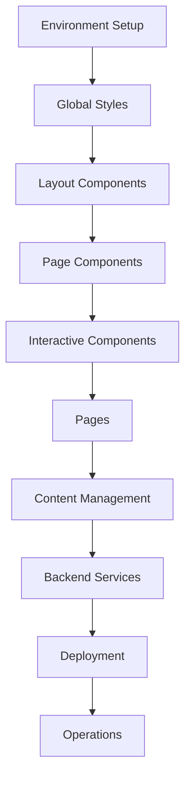

# IMPLEMENTATION ROADMAP - Litecky Editing Services
## Logical Build Order & Dependencies

Last Updated: September 23, 2025 (11:45)

---

## 📊 Documentation Phase ✅ COMPLETE

### All Files Read (15/15 - 100%)
1. ✅ project-document.md (1355 lines) - Core project specs
2. ✅ production-files.md (870 lines) - Production implementations
3. ✅ cloudflare-deployment.md (1310 lines) - Full deployment config
4. ✅ deployment-config.md (500 lines) - Deployment details
5. ✅ decap-cms-setup.md (750 lines) - CMS configuration
6. ✅ code-quality-setup.md (944 lines) - Quality tools
7. ✅ secrets-env-setup.md (824 lines) - Secrets management
8. ✅ operations-reliability.md (1048 lines) - Operations config
9. ✅ documentation.md (1432 lines) - Documentation standards
10. ✅ policy-as-code.md (967 lines) - Policy as code
11-15. ✅ All .clinerules files (5 files) - Memory Bank system

### Documentation Reorganization Complete
- ✅ All 15 spec docs moved to `_archive/`
- ✅ User docs created from templates in `documentation.md`
- ✅ Project structure follows documentation standards
- ✅ Clear separation between specs (archive) and active docs

---

## 🎯 CRITICAL: Implementation Order

### Phase 0: Foundation ✅ COMPLETE
**Infrastructure and tooling ready**

1. **Repository & Structure** ✅
   - [x] Git repository initialized
   - [x] GitHub remote configured
   - [x] Astro project structure
   - [x] All directories created

2. **Configuration** ✅
   - [x] Tailwind CSS v4 with Vite plugin
   - [x] TypeScript configuration
   - [x] Package.json with correct versions
   - [x] mise for version management

3. **Policy & Validation** ✅
   - [x] Rego policies defined
   - [x] Validation scripts created
   - [x] CI/CD workflows configured
   - [x] Pre-commit hooks setup

### Phase 1: Core Styling & Layout ✅ COMPLETE
**Single-source styles and accessible base layout**

1. **Global Styles**
  - [x] src/styles/global.css (Lines 229-496)
  - [x] Tailwind v4 @theme tokens
  - [x] Typography system
  - [x] Color palette
  - [x] Spacing scale

2. **Base Layout Enhancement**
  - [x] BaseLayout.astro (enhanced)
  - [x] SEO meta tags
  - [x] Schema.org JSON-LD (WebSite, Organization)
  - [x] Skip link
  - [x] Font loading

3. **Navigation Script**
  - [x] menu-toggle.js (Lines 499-561)
  - [x] Mobile menu functionality
  - [x] ARIA attributes

### Phase 2: Core Components ✅ COMPLETE (initial)
**8 components needed for site structure**

1. **Header.astro** (Lines 599-775)
2. **Footer.astro** (Site-wide)
3. **Hero.astro** (Lines 777-959)
4. **TrustBar.astro** (Lines 961-1034)
5. **ProcessSnapshot.astro** (3-step process)
6. **FeaturedTestimonial.astro** (Carousel)
7. **ValueProp.svelte** (Interactive)
8. **FileUpload.svelte** (Lines 1036-1308)

6. **Pages** (After components exist)
   - [x] index.astro updated with components
   - [x] services.astro
   - [x] process.astro
   - [x] about.astro
   - [x] testimonials.astro
   - [x] faq.astro
   - [x] contact.astro

7. **Scripts**
   - [x] menu-toggle.js (mobile nav)

### Phase 3: Content Management
**After static site works locally**

8. **Content Collections**
  - [x] src/content/config.ts
  - [x] Content folders structure
  - [ ] Sample content files

9. **Decap CMS Setup**
  - [x] public/admin/index.html
  - [x] public/admin/config.yml
  - [ ] GitHub OAuth App creation
  - [ ] OAuth Worker deployment (workers/decap-oauth)

### Phase 4: Backend Services
**After frontend is stable**

10. **Cloudflare Workers**
    - [ ] Decap OAuth proxy worker (scaffold added)
    - [ ] Contact form handler (Pages Function scaffold added)
    - [ ] Document upload handler

11. **Email Integration**
    - [ ] SendGrid account setup
    - [ ] Domain authentication
    - [ ] Email templates
    - [ ] API integration

12. **Form Protection**
    - [ ] Turnstile setup
    - [ ] Client-side integration
    - [ ] Server-side validation

### Phase 5: Cloudflare Deployment (6 Sub-phases)
**After frontend complete - See CLOUDFLARE-DEPLOYMENT-WORKFLOW.md**

#### Phase 5.0: Pre-Deployment Prep ✅
- [x] Complete frontend to deployable state
- [x] Pass all validations and tests
- [x] Build production bundle

#### Phase 5.1: Infrastructure Setup ✅
- [x] Create D1 database (litecky-db: 208dd91d-8f15-40ef-b23d-d79672590112)
- [x] Create R2 bucket (litecky-uploads)
- [x] Create KV namespace (CACHE: 6d85733ce2654d9980caf3239a12540a)
- [x] Create Queue (deferred - requires paid plan)

#### Phase 5.2: Security & Auth 🟡
- [x] Configure Turnstile (Widget created, keys stored)
- [ ] Create GitHub OAuth App
- [x] Store credentials in gopass (Turnstile keys stored)

#### Phase 5.3: Workers Deployment
- [ ] Deploy OAuth Worker
- [ ] Deploy Cron Worker
- [ ] Deploy Queue Consumer

#### Phase 5.4: Main Site Deployment 🟡
- [x] Create Pages project (litecky-editing-services)
- [ ] Configure environment variables
- [ ] Migrate DNS from Google
- [x] Deploy site (https://c9bfafd5.litecky-editing-services.pages.dev)

#### Phase 5.5: Email Configuration
- [ ] SendGrid setup
- [ ] Email templates
- [ ] DNS records for email

#### Phase 5.6: Verification
- [ ] Functional tests
- [ ] Update documentation
- [ ] Enable monitoring

### Phase 6: Operations
**After deployed**

16. **Monitoring**
    - [ ] Analytics setup
    - [ ] Error tracking
    - [ ] Performance monitoring
    - [ ] Uptime checks

17. **Security**
    - [ ] Headers configuration
    - [ ] Rate limiting
    - [ ] CORS setup
    - [ ] CSP policy

---

## 🚨 Current Blockers

1. ~~**Code Quality Setup**: Biome, ESLint flat config, tests (Vitest/Playwright/pa11y)~~ ✅ COMPLETE
2. ~~**CMS Integration**: Decap admin, config.yml, content collections~~ ✅ 75% COMPLETE
3. **Backend Services**: OAuth Worker, document upload (Contact API created)
4. ~~**Infra**: D1/R2/KV/Queues setup per Cloudflare plan~~ ✅ COMPLETE

---

## 📋 IMMEDIATE NEXT ACTIONS (Priority Order)

### ✅ CRITICAL BLOCKERS RESOLVED

### 🚀 Next Priority Actions:
2. **Enhance BaseLayout.astro**
   - Add complete SEO meta tags
   - Implement Schema.org JSON-LD
   - Add skip links for accessibility

3. **Create menu-toggle.js**
   - Extract from project-document.md lines 499-561
   - Implement mobile navigation

4. **Build Header.astro**
   - Extract from project-document.md lines 599-775
   - Desktop and mobile navigation

5. **Build Footer.astro**
   - Standard site footer
   - Contact info and links

6. **Build Hero.astro**
   - Extract from project-document.md lines 777-959
   - Homepage hero section

7. **Build remaining 5 components**
   - TrustBar, ProcessSnapshot, Testimonial
   - ValueProp.svelte, FileUpload.svelte

8. **Update index.astro**
   - Integrate all components
   - Complete homepage

9. **Create 6 additional pages**
   - services, process, about
   - testimonials, faq, contact

10. **Set up code quality tools**
    - Biome, ESLint, Prettier
    - Testing frameworks

---

## ⚠️ Critical Path Dependencies

---

## 📈 Progress Metrics

| Phase | Status | Progress | Blocking Next Phase? |
|-------|--------|----------|---------------------|
| Foundation | ✅ Complete | 100% | No |
| Core Styling | ✅ Complete | 100% | No |
| Components | ✅ Initial | 100% | No |
| Pages | ✅ Initial | 100% | No |
| CMS Integration | 🟡 In Progress | 75% | OAuth Worker needed |
| Backend Services | 🟡 In Progress | 30% | Contact API done, workers needed |
| Cloudflare Infra | ✅ Complete | 100% | D1, R2, KV created |
| Deployment | 🟡 In Progress | 40% | Initial deployment complete |
| Operations | 🔴 Not Started | 0% | Pending |

**Overall Project Completion: ~65%** (Frontend complete; Turnstile security active; CMS 75% done; API enhanced; infrastructure deployed; live site protected)

---

## 🔑 Key Decisions Made

1. **Tailwind v4** instead of v3 (user directive)
2. **pnpm** instead of npm (user directive)
3. **Node 24** requirement (user directive)
4. **Cloudflare Pages only** — no Vercel/Netlify adapters; sitemap pinned to v3.6+
5. **Decap CMS** for content management

---

## 📝 Notes

- The project is structured as a professional service website
- Heavy emphasis on trust signals and conversion optimization
- Requires both static and dynamic components
- Multi-stage deployment with various Cloudflare services
- Content management for non-technical users is critical
