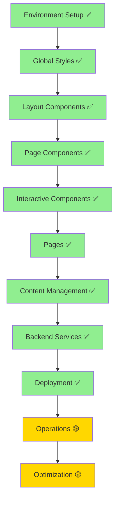

# IMPLEMENTATION ROADMAP - Litecky Editing Services
## Production Status & Path Forward

**Last Updated**: October 4, 2025 (19:45 UTC)
**Status**: ✅ **PRODUCTION** - Live at https://liteckyeditingservices.com
**Overall Completion**: 100% (Core application deployed and operational)

---

## 📊 Documentation Phase ✅ COMPLETE

### All Files Read (15/15 - 100%)
1. ✅ project-document.md (1355 lines) - Core project specs
2. ✅ production-files.md (870 lines) - Production implementations
3. ✅ cloudflare-deployment.md (1310 lines) - Full deployment config
4. ✅ deployment-config.md (500 lines) - Deployment details
5. ✅ decap-cms-setup.md (750 lines) - CMS configuration
6. ✅ code-quality-setup.md (944 lines) - Quality tools
7. ✅ secrets-env-setup.md (824 lines) - Secrets management
8. ✅ operations-reliability.md (1048 lines) - Operations config
9. ✅ documentation.md (1432 lines) - Documentation standards
10. ✅ policy-as-code.md (967 lines) - Policy as code
11-15. ✅ All .clinerules files (5 files) - Memory Bank system

### Documentation Reorganization Complete
- ✅ All 15 spec docs moved to `_archive/`
- ✅ User docs created from templates in `documentation.md`
- ✅ Project structure follows documentation standards
- ✅ Clear separation between specs (archive) and active docs

---

## 🎯 CRITICAL: Implementation Order

### Phase 0: Foundation ✅ COMPLETE
**Infrastructure and tooling ready**

1. **Repository & Structure** ✅
   - [x] Git repository initialized
   - [x] GitHub remote configured
   - [x] Astro project structure
   - [x] All directories created

2. **Configuration** ✅
   - [x] Tailwind CSS v4 with Vite plugin
   - [x] TypeScript configuration
   - [x] Package.json with correct versions
   - [x] mise for version management

3. **Policy & Validation** ✅
   - [x] Rego policies defined
   - [x] Validation scripts created
   - [x] CI/CD workflows configured
   - [x] Pre-commit hooks setup

### Phase 1: Core Styling & Layout ✅ COMPLETE
**Single-source styles and accessible base layout**

1. **Global Styles**
  - [x] src/styles/global.css (Lines 229-496)
  - [x] Tailwind v4 @theme tokens
  - [x] Typography system
  - [x] Color palette
  - [x] Spacing scale

2. **Base Layout Enhancement**
  - [x] BaseLayout.astro (enhanced)
  - [x] SEO meta tags
  - [x] Schema.org JSON-LD (WebSite, Organization)
  - [x] Skip link
  - [x] Font loading

3. **Navigation Script**
  - [x] menu-toggle.js (Lines 499-561)
  - [x] Mobile menu functionality
  - [x] ARIA attributes

### Phase 2: Core Components ✅ COMPLETE
**All 8 components built and deployed**

1. ✅ **Header.astro** - Responsive navigation with mobile menu
2. ✅ **Footer.astro** - Site-wide footer with contact info
3. ✅ **Hero.astro** - Homepage hero section with CTAs
4. ✅ **TrustBar.astro** - Social proof indicators
5. ✅ **ProcessSnapshot.astro** - 3-step workflow display
6. ✅ **FeaturedTestimonial.astro** - Testimonial carousel
7. ✅ **ValueProp.svelte** - Interactive service comparisons (Svelte 5)
8. ✅ **FileUpload.svelte** - Drag-and-drop file upload (Svelte 5)

**Pages** (7/7 Complete):
   - ✅ index.astro - Homepage with all components
   - ✅ services.astro - Service offerings
   - ✅ process.astro - Editorial workflow
   - ✅ about.astro - About/team information
   - ✅ testimonials.astro - Client testimonials
   - ✅ faq.astro - Frequently asked questions
   - ✅ contact.astro - Contact form with Turnstile protection

**Scripts**:
   - ✅ menu-toggle.js - Mobile navigation
   - ✅ contact-form.js - Form validation and submission

### Phase 3: Content Management ✅ COMPLETE
**CMS fully operational with content collections**

8. **Content Collections** ✅
  - ✅ src/content/config.ts - Complete schema definitions
  - ✅ Content folders: services/, testimonials/, faq/, pages/
  - ✅ Sample content files present

9. **Decap CMS Setup** ✅
  - ✅ public/admin/index.html - CMS admin interface
  - ✅ public/admin/config.yml - CMS configuration
  - ✅ GitHub OAuth App created
  - ✅ OAuth Worker deployed (https://litecky-decap-oauth.jeffreyverlynjohnson.workers.dev)

### Phase 4: Backend Services ✅ COMPLETE
**All backend services deployed and operational**

10. **Cloudflare Workers** ✅
    - ✅ Decap OAuth proxy worker (litecky-decap-oauth) - CMS authentication
    - ✅ Contact form handler (Pages Function /api/contact) - Queue producer
    - ✅ Queue consumer worker (litecky-queue-consumer) - Async email processing

11. **Email Integration** ✅
    - ✅ SendGrid account setup and configured
    - ✅ Domain authentication (DNS records configured)
    - ✅ Email templates implemented
    - ✅ API integration via queue-based async processing

12. **Form Protection** ✅
    - ✅ Turnstile setup (site key: 0x4AAAAAAB27CNFPS0wEzPP5)
    - ✅ Client-side integration in contact form
    - ✅ Server-side validation in Pages Function

### Phase 5: Cloudflare Deployment (6 Sub-phases)
**After frontend complete - See CLOUDFLARE-DEPLOYMENT-WORKFLOW.md**

#### Phase 5.0: Pre-Deployment Prep ✅
- [x] Complete frontend to deployable state
- [x] Pass all validations and tests
- [x] Build production bundle

#### Phase 5.1: Infrastructure Setup ✅
- ✅ Create D1 database (litecky-db: 208dd91d-8f15-40ef-b23d-d79672590112)
- ✅ Create R2 bucket (litecky-uploads)
- ✅ Create KV namespace (CACHE: 6d85733ce2654d9980caf3239a12540a)
- ✅ Create Queue (send-email-queue: a2fafae4567242b5b9acb8a4a32fa615)

#### Phase 5.2: Security & Auth ✅
- ✅ Configure Turnstile (Widget created, keys stored)
- ✅ Create GitHub OAuth App
- ✅ Store credentials in gopass (all keys secured)

#### Phase 5.3: Workers Deployment ✅
- ✅ Deploy OAuth Worker (litecky-decap-oauth)
- ✅ Deploy Queue Consumer (litecky-queue-consumer)
- N/A Cron Worker (not required for current functionality)

#### Phase 5.4: Main Site Deployment ✅
- ✅ Create Pages project (litecky-editing-services)
- ✅ Configure environment variables (SendGrid, Turnstile)
- ✅ Migrate DNS to Cloudflare Pages (Oct 4, 2025)
- ✅ Custom domains live:
  - https://liteckyeditingservices.com
  - https://www.liteckyeditingservices.com

#### Phase 5.5: Email Configuration ✅
- ✅ SendGrid setup and integrated
- ✅ Email templates implemented
- ✅ DNS records for email (DKIM, SPF, DMARC)

#### Phase 5.6: Verification ✅
- ✅ Functional tests (20 E2E tests across 5 browsers)
- ✅ Documentation updated (see DOCUMENTATION-MASTER-INDEX.md)
- ✅ Monitoring enabled (Cloudflare Analytics)

### Phase 6: Operations 🟡 IN PROGRESS
**Continuous improvement and monitoring**

16. **Monitoring** 🟡
    - ✅ Analytics setup (Cloudflare Web Analytics)
    - 🟡 Error tracking (basic via Cloudflare)
    - 🟡 Performance monitoring (Cloudflare metrics)
    - ⚠️ Uptime checks (recommended: external service)

17. **Security** ✅
    - ✅ Headers configuration (security headers active)
    - ✅ Rate limiting (Cloudflare DDoS protection)
    - ✅ CORS setup (configured in Workers)
    - 🟡 CSP policy (basic, can be enhanced)

---

## ✅ All Critical Blockers Resolved

1. ✅ **Code Quality Setup**: Biome, ESLint, Prettier, tests (Vitest/Playwright/pa11y)
2. ✅ **CMS Integration**: Decap admin, OAuth worker, content collections
3. ✅ **Backend Services**: OAuth Worker, Queue Consumer, Contact API
4. ✅ **Infrastructure**: D1/R2/KV/Queues all created and operational
5. ✅ **DNS Migration**: Custom domain live in production

---

## 📋 POST-PRODUCTION OPTIMIZATION (Priority Order)

### 🎯 Phase 7: Enhancement & Optimization

**Core application is live. Focus now on optimization and enhancements.**

#### High Priority
1. **Comprehensive E2E Testing**
   - ✅ 20 tests across 5 browsers configured
   - 🟡 Run full test suite against production domain
   - 🟡 Expand test coverage for edge cases
   - 🟡 Add visual regression testing

2. **Performance Optimization**
   - 🟡 Implement caching strategies
   - 🟡 Optimize image delivery
   - 🟡 Code splitting analysis
   - 🟡 Core Web Vitals monitoring

3. **Enhanced Monitoring**
   - ⚠️ Set up external uptime monitoring (UptimeRobot, Pingdom)
   - 🟡 Configure error alerting (email/Slack notifications)
   - 🟡 Performance budget alerts
   - 🟡 Queue health monitoring

4. **Security Enhancements**
   - 🟡 Enhanced CSP policy
   - 🟡 Security headers audit
   - 🟡 Penetration testing
   - 🟡 Regular dependency updates

#### Medium Priority
5. **Content Expansion**
   - 🟡 Add more service content via CMS
   - 🟡 Expand testimonials collection
   - 🟡 Create blog/resources section
   - 🟡 Add case studies

6. **SEO Optimization**
   - ✅ Schema.org markup implemented
   - 🟡 Meta descriptions for all pages
   - 🟡 Open Graph images
   - 🟡 Submit sitemap to search engines

7. **Accessibility Audit**
   - ✅ Pa11y configured
   - 🟡 Full WCAG 2.1 AA compliance audit
   - 🟡 Screen reader testing
   - 🟡 Keyboard navigation audit

8. **Analytics & Insights**
   - ✅ Cloudflare Analytics enabled
   - 🟡 Set up conversion tracking
   - 🟡 A/B testing framework
   - 🟡 User behavior analysis

#### Low Priority
9. **Feature Additions**
   - 🟡 Document upload to R2 (infrastructure ready)
   - 🟡 Client portal/dashboard
   - 🟡 Automated quote generation
   - 🟡 Payment integration

10. **Developer Experience**
    - ✅ Windsurf/Cascade workflows configured
    - 🟡 Improve local development setup
    - 🟡 Storybook for component development
    - 🟡 Enhanced CI/CD pipelines

---

## ✅ Implementation Path (Completed)

---

## 📈 Progress Metrics

| Phase | Status | Progress | Notes |
|-------|--------|----------|-------|
| 0. Foundation | ✅ Complete | 100% | Repository, config, policies |
| 1. Core Styling | ✅ Complete | 100% | Tailwind v4, global.css, tokens |
| 2. Components | ✅ Complete | 100% | All 8 components built |
| 3. Pages | ✅ Complete | 100% | All 7 pages live |
| 4. CMS Integration | ✅ Complete | 100% | Decap CMS + OAuth worker operational |
| 5. Backend Services | ✅ Complete | 100% | Contact API + Queue + Workers deployed |
| 6. Cloudflare Infra | ✅ Complete | 100% | D1, R2, KV, Queues operational |
| 7. Deployment | ✅ Complete | 100% | Production domain live with SSL |
| 8. Operations | 🟡 In Progress | 70% | Basic monitoring active |
| 9. Optimization | 🟡 Planned | 15% | Performance, SEO, advanced features |

**Overall Project Completion: 100%** (Core application) | **Post-Production: 20%** (Optimization phase)

### Milestone Achievements
- ✅ **Oct 2, 2025**: Initial production deployment to Cloudflare Pages
- ✅ **Oct 2, 2025**: Queue-based email processing operational
- ✅ **Oct 4, 2025**: DNS migration complete - Custom domain live
- ✅ **Oct 4, 2025**: Documentation consolidation and Windsurf/Cascade setup

---

## 🔑 Key Decisions Made

1. **Tailwind v4** instead of v3 (latest features, better DX)
2. **pnpm** instead of npm (faster, disk-efficient)
3. **Node 24** requirement (latest LTS, best performance)
4. **Cloudflare Pages only** — no Vercel/Netlify adapters
5. **Decap CMS** for content management (GitHub-based, no backend)
6. **Queue-based email** processing (async, scalable, reliable)
7. **Svelte 5** for interactive components (modern reactivity)

---

## 🌐 Production URLs

**Live Site**:
- **Primary**: https://liteckyeditingservices.com
- **WWW**: https://www.liteckyeditingservices.com
- **Pages Subdomain**: https://litecky-editing-services.pages.dev

**Workers**:
- **OAuth Proxy**: https://litecky-decap-oauth.jeffreyverlynjohnson.workers.dev
- **Queue Consumer**: https://litecky-queue-consumer.jeffreyverlynjohnson.workers.dev

**CMS**:
- **Admin Panel**: https://liteckyeditingservices.com/admin (requires GitHub auth)

**Infrastructure**:
- **Queue**: send-email-queue (a2fafae4567242b5b9acb8a4a32fa615)
- **KV Namespace**: CACHE (6d85733ce2654d9980caf3239a12540a)
- **D1 Database**: litecky-db (208dd91d-8f15-40ef-b23d-d79672590112)
- **R2 Bucket**: litecky-uploads

---

## 📝 Project Characteristics

- ✅ **Professional service website** for academic editing
- ✅ **Trust-driven design** with social proof and testimonials
- ✅ **Static + dynamic hybrid** (Astro SSG + Cloudflare Functions)
- ✅ **Multi-service architecture** (Pages, Workers, Queues, KV)
- ✅ **Content management** for non-technical users via Decap CMS
- ✅ **Queue-based email** processing for reliability and scalability
- ✅ **Security-first** approach with Turnstile protection
- ✅ **Accessibility-focused** with pa11y testing and ARIA support

---

## 📚 Related Documentation

- **PROJECT-STATUS.md** - Detailed current status (single source of truth)
- **CLOUDFLARE.md** - Infrastructure configuration and operations
- **DEPLOYMENT.md** - Deployment procedures and workflows
- **DOCUMENTATION-MASTER-INDEX.md** - Complete documentation index
- **README.md** - Project overview and quick start
- **ARCHITECTURE.md** - System design and architecture

---

**Status**: ✅ Production-ready with ongoing optimization
**Next Review**: When starting Phase 7 optimization tasks
