# IMPLEMENTATION ROADMAP - Litecky Editing Services

## Production Status & Path Forward

**Last Updated**: October 12, 2025 (Comprehensive CI/CD and quality enhancements complete)
**Status**: ✅ **PRODUCTION** - Live with Git-Connected Deployment + Optimized CI/CD
**Overall Completion**: 100% (Core application deployed and operational with enhanced monitoring)

---

## 🚀 Next Steps Plan (Oct 5–18, 2025)

### ✅ COMPLETED: Git-Connected Deployment (October 5, 2025)

**Migration Success**: Cloudflare Pages now Git-connected with automatic deployments working.

**Completed Actions**:

1. ✅ Git-Connected Deployment

- ✅ Migrated from `litecky-editing-services` (direct upload) to `liteckyeditingservices` (Git-connected)
- ✅ Custom domains transferred successfully
- ✅ Automatic deployments on push to main working
- ✅ PR preview deployments enabled

2. ✅ CI/CD Enabled

- ✅ `.github/workflows/deploy-production.yml` - Noop mode for Git-connected
- ✅ GitHub secrets configured: `CF_GIT_CONNECTED=true`
- ✅ Post-deploy validation passing (15/15 security headers tests)
- ✅ Quality gate and E2E workflows operational

3. ✅ CSP Fix Deployed

- ✅ Added `data:` to script-src for Vite-inlined scripts
- ✅ All CSP violations resolved in production
- ✅ Automated validation tests passing

### Phase 7: Deployment & Operations Enhancement (5 Weeks)

#### Week 1: Foundation (Oct 4-5, 2025) - ✅ COMPLETE

**Deployment Automation & Monitoring Setup**

1. **CI/CD Pipeline** - ✅ COMPLETE

- [x] ✅ Git-connected deployment migrated and operational
- [x] ✅ Automated deployment workflow (`.github/workflows/deploy-production.yml`)
- [x] ✅ Pre-deployment quality checks (quality-gate.yml)
- [x] ✅ Post-deployment validation (post-deploy-validation.yml)
- [x] ✅ Preview deployments for PRs (preview-validation.yml)

2. **Monitoring & Reliability** - ✅ Documentation Complete

- [x] ✅ Documentation complete (3 comprehensive guides)
- [x] ✅ DNS configuration documented with verification commands
- [x] ✅ Secrets automation scripts (gopass sync for Pages/Workers)
- [ ] Set up UptimeRobot monitors (30 min) - Week 2
- [ ] Deploy error monitoring Worker (2 hours) - Week 2
- [ ] Deploy queue health Worker (2.5 hours) - Week 2

3. **Testing & Quality** - 🔄 MODERNIZED (Oct 5, 2025)

- [x] ✅ Production E2E tests passing (18/20 tests)
- [x] ✅ Visual regression tests MODERNIZED with October 2025 best practices:
  - ✅ Deterministic rendering in `playwright.config.ts`
  - ✅ Screenshot stabilization CSS (`_screenshot.css`)
  - ✅ Hardening helpers in `_prepare.ts`
  - ✅ Modern GitHub Actions workflow with baseline management
  - ✅ Viewport-only screenshots (avoiding fullPage flake)
  - ✅ Component-level visual tests for stability
- [x] ✅ Security headers tests (15/15 passing in production)
- [x] ✅ CSP violations fixed (data: URI support added)
- [x] ✅ Post-deployment validation workflow active
- [ ] Expand E2E coverage for edge cases - Week 2
- [ ] A11y sweep to WCAG 2.1 AA - Week 2

#### Week 2: CI/CD & Quality Enhancement (Oct 12-18, 2025) - ✅ PHASES 1-3 COMPLETE

**CI/CD Pipeline Enhancements & Quality Tooling**

1. **Phase 1: CI/CD Enhancements** - ✅ COMPLETE (Oct 12, 2025)

- [x] ✅ Preflight job implementation (secrets/variables verification)
- [x] ✅ Caching strategy (pnpm store + Playwright browsers)
- [x] ✅ Concurrency controls (cancel duplicate PR runs)
- [x] ✅ Wrangler version pinning (4.40.3)
- [x] ✅ Sourcemap verification
- [x] ✅ Expected performance improvement: ~40% faster workflows

2. **Phase 2: Sentry Integration** - ✅ COMPLETE (Oct 12, 2025)

- [x] ✅ Sourcemap configuration (vite.build.sourcemap: true)
- [x] ✅ Enhanced middleware with sensitive data scrubbing
- [x] ✅ Environment-based sampling (10% prod, 100% dev/preview)
- [x] ✅ Security headers (HSTS production-only)
- [x] ✅ Release tracking with commit SHA
- [x] ✅ Privacy protection (PII filtering)

3. **Phase 3: Biome v2.2.5 Migration** - ✅ COMPLETE (Verified Oct 12, 2025)

- [x] ✅ Biome pinned to v2.2.5
- [x] ✅ biome.jsonc properly configured
- [x] ✅ .prettierignore updated (JS/TS/JSON excluded)
- [x] ✅ Package scripts configured (compact, github, summary reporters)
- [x] ✅ VCS integration enabled
- [x] ✅ Performance validated (<10s typical)

4. **Remaining Tasks: Testing & Validation** - 🔜 NEXT (Oct 13-18, 2025)

- [ ] Expand E2E test coverage for edge cases
- [ ] Lighthouse CI integration
- [ ] Bundle size analysis
- [ ] Security vulnerability scanning (Snyk)
- [ ] Dependency audit automation
- [ ] Admin panel health checks automation
- [ ] Performance metrics collection

### Phase 8: Admin CMS Delivery Migration (CDN → npm)

Goal: Replace vendored `decap-cms.js` with a first-party bundle from `decap-cms-app` for deterministic init and hydration.

Status: Implemented on Oct 11, 2025

1. Scaffold — COMPLETE

- Added `src/admin/cms.ts` with `decap-cms-app` init and canonical auth listener.

2. Build path — COMPLETE

- `scripts/build-cms.mjs` (esbuild) emits `public/admin/cms.js` (no sourcemaps).

3. Flip — COMPLETE

- Admin HTML now loads `/admin/cms.js`. Vendor reference removed (file remains for now for validators).

4. Soak — IN PROGRESS

- Keep hydrator for one release; monitor `hydr:*` breadcrumbs.

5. Retire vendor bundle — TODO

- Remove `/public/vendor/decap/*` and validation references once verified.

### Phase 9: Secrets Orchestration via Infisical (Production SoT)

Goal: Use Infisical as the source of truth for production/preview secrets and automate sync to Cloudflare Pages and Workers.

Status: In progress

1. Scripts — COMPLETE

- scripts/secrets/infisical_seed_prod_from_gopass.sh
- scripts/secrets/infisical_pull_prod.sh
- scripts/secrets/cloudflare_prepare_from_infisical.sh

2. Documentation — COMPLETE

- docs/INFISICAL-QUICKSTART.md
- SECRETS.md (inventory + rotation)
- DOCUMENTATION-MASTER-INDEX.md (indexed)

3. CI integration — TODO

- Add GitHub Actions workflow to:
  - infisical export (projectId + env)
  - prepare public.env + secrets.env
  - wrangler pages secret put for Secrets
  - wrangler pages project variable set for public vars
  - workers secret sync (if applicable)

4. Source of truth — COMPLETE

- Local dev stays on gopass → .dev.vars
- Production/Preview managed in Infisical

Dependencies

- Sentry optional for admin (breadcrumbs useful).
- CSP for `/admin/*` compatible (no inline/module scripts required).

Docs/ADR

- ADR-002 updated to Implemented; playbook present for reference.

#### Week 3: Observability (Oct 19-25, 2025)

**Analytics & Performance Monitoring**

1. **Analytics Integration**

- [ ] Deploy analytics collector Worker
- [ ] Set up Cloudflare Analytics Engine
- [ ] Configure custom events tracking
- [ ] Create performance dashboard

2. **Performance Monitoring**

- [ ] Implement Server-Timing headers
- [ ] Core Web Vitals tracking
- [ ] Slow response logging
- [ ] Resource timing analysis

#### Week 4: Advanced Features (Oct 26-Nov 1, 2025)

**Blue-Green Deployment & Rollback**

1. **Deployment Strategies**

- [ ] Blue-green deployment workflow
- [ ] Quick rollback capability
- [ ] Feature flag system (KV-based)
- [ ] A/B testing infrastructure

2. **Traffic Management**

- [ ] Canary deployments
- [ ] Gradual rollout controls
- [ ] Geographic routing rules
- [ ] Maintenance mode toggle

#### Week 5: Disaster Recovery (Nov 2-8, 2025)

**Backup & Recovery Systems**

1. **Backup Strategy**

- [ ] Daily D1 database backups
- [ ] KV namespace exports
- [ ] R2 bucket replication
- [ ] Automated backup to R2

2. **Recovery Planning**

- [ ] Incident response runbooks
- [ ] Restore procedure testing
- [ ] Disaster recovery drills
- [ ] Business continuity plan

### Original Workstreams (Continuing)

4. **Security** ✅ Complete

- [x] ✅ Comprehensive security headers implemented
- [x] ✅ Admin CSP properly configured
- [ ] Run validation playbook (30 min)
- [ ] Verify SecurityHeaders.com grade A

5. **SEO & Content**

- [ ] Meta descriptions for all pages and Open Graph images
- [ ] Submit sitemap to Google/Bing
- [ ] Add 2–3 high-value content pieces

Developer Workflow Hooks

- Prefer Windsurf Cascade workflows (Dev Loop, Quick Validate, A11y + E2E, Build Preview).
- Commands: `pnpm validate:all`, `pnpm typecheck`, `pnpm test`, `pnpm test:e2e`, `pnpm test:a11y`, `pnpm build`.

### Biome v2.2.5 Migration (Quality & DX) - ✅ COMPLETE (Oct 12, 2025)

- Problem - RESOLVED
  - Prior Biome runs occasionally hung due to deep-directory ignore patterns and legacy scanner settings.
  - We temporarily routed `check` through Prettier only, reducing coverage for JS/TS/JSON.

- Objective - ACHIEVED
  - ✅ Pinned Biome to v2.2.5 and adopted canonical `biome.jsonc` scoped to JS/TS/JSON/JSONC only.
  - ✅ Replaced deep `**` excludes with directory-level excludes to stop crawling large folders.
  - ✅ Reintroduced Biome into local `check` and CI via `biome:check`/`biome:ci`.

- Deliverables - IN PLACE
  - ✅ biome.jsonc (version-locked, allowlist-first + folder-level excludes)
  - ✅ package.json updates (pin v2.2.5, scripts, `check` pipeline)
  - ✅ .prettierignore updates to avoid formatter overlap (JS/TS/JSON excluded)
  - 📝 docs/decisions/2025-10-12-biome-2.2.5.md (optional documentation - can be added)
  - 📝 docs/playbooks/biome.md (optional usage guide - can be added)

- Acceptance Criteria - ✅ MET
  - ✅ `pnpm run biome:check` completes quickly on a warm cache (<10s typical) - VERIFIED
  - ✅ `pnpm run check` passes locally and on CI with Biome enabled (no hangs) - VERIFIED
  - ✅ CI uses `pnpm run biome:ci` (read-only) and fails on violations without mutations - CONFIGURED

- Tasks - ✅ ALL COMPLETE
  1. ✅ Pin `@biomejs/biome@2.2.5`
  2. ✅ Replace `biome.json` with `biome.jsonc` (canonical config)
  3. ✅ Update `.prettierignore` to exclude JS/TS/JSON/JSONC
  4. ✅ Update scripts; add Biome into `check`
  5. ✅ Run verification: biome:check → check → policy:check

- Status
  - ✅ COMPLETE - Implementation verified and all validations passing.

### Deployment Workflow Files

- ✅ `.github/workflows/deploy-production.yml` - Automated deployment (disabled when Git-connected)
- ✅ `.github/workflows/post-deploy-validation.yml` - Post-deployment health checks
- ✅ `.github/workflows/preview-validation.yml` - PR preview validation (homepage + admin)

### Migration Track: Pages Alignment

- Read: `docs/migrations/DEPLOYMENT-ALIGNMENT-REPORT.md`
- Execute: `docs/migrations/PAGES-GIT-MIGRATION.md` (Git-connected project creation + domain cutover)
- Environment variables: `docs/migrations/PAGES-ENV-CHECKLIST.md`
- Cutover steps: `docs/migrations/PAGES-GIT-CUTOVER-RUNBOOK.md`

### Required GitHub Secrets (Final)

```bash
CLOUDFLARE_ACCOUNT_ID      # Your Cloudflare account ID
CLOUDFLARE_API_TOKEN        # API token with Pages:Edit permission
# After migration:
CF_GIT_CONNECTED=true       # disables Wrangler auto-promote job
```

### Milestones

- ✅ **Week 1 (Oct 4-5, 2025)**: Monitoring docs + prod E2E + security headers + visual regression + Git migration + CSP fix - **COMPLETE**
- ✅ **Git-connected migration**: Completed Oct 5; auto-deployments enabled
- ✅ **Week 2 (Oct 6, 2025)**: Seed Linux visual baselines; make `e2e-visual` blocking; pin Playwright 1.55.1; align docs/workflows - **COMPLETE**
- ✅ **Week 2 (Oct 12, 2025)**: CI/CD enhancements (Phases 1-3) - Preflight, caching, concurrency, Sentry integration, Biome v2.2.5 - **COMPLETE**
- 🔜 **Week 2 (Oct 13-18, 2025)**: Testing infrastructure expansion + E2E coverage + documentation (Phase 4)
- 🔜 **Week 3 (Oct 19-25, 2025)**: Operational excellence + documentation + security enhancements (Phases 5-6)

---

## 📊 Documentation Phase ✅ COMPLETE

### All Files Read (15/15 - 100%)

1. ✅ project-document.md (1355 lines) - Core project specs
2. ✅ production-files.md (870 lines) - Production implementations
3. ✅ cloudflare-deployment.md (1310 lines) - Full deployment config
4. ✅ deployment-config.md (500 lines) - Deployment details
5. ✅ decap-cms-setup.md (750 lines) - CMS configuration
6. ✅ code-quality-setup.md (944 lines) - Quality tools
7. ✅ secrets-env-setup.md (824 lines) - Secrets management
8. ✅ operations-reliability.md (1048 lines) - Operations config
9. ✅ documentation.md (1432 lines) - Documentation standards
10. ✅ policy-as-code.md (967 lines) - Policy as code
    11-15. ✅ All .clinerules files (5 files) - Memory Bank system

### Documentation Reorganization Complete

- ✅ All 15 spec docs moved to `_archive/`
- ✅ User docs created from templates in `documentation.md`
- ✅ Project structure follows documentation standards
- ✅ Clear separation between specs (archive) and active docs

---

## 🎯 CRITICAL: Implementation Order

### Phase 0: Foundation ✅ COMPLETE

**Infrastructure and tooling ready**

1. **Repository & Structure** ✅
   - [x] Git repository initialized
   - [x] GitHub remote configured
   - [x] Astro project structure
   - [x] All directories created

2. **Configuration** ✅
   - [x] Tailwind CSS v4 with Vite plugin
   - [x] TypeScript configuration
   - [x] Package.json with correct versions
   - [x] mise for version management

3. **Policy & Validation** ✅
   - [x] Rego policies defined
   - [x] Validation scripts created
   - [x] CI/CD workflows configured
   - [x] Pre-commit hooks setup

### Phase 1: Core Styling & Layout ✅ COMPLETE

**Single-source styles and accessible base layout**

1. **Global Styles**

- [x] src/styles/global.css (Lines 229-496)
- [x] Tailwind v4 @theme tokens
- [x] Typography system
- [x] Color palette
- [x] Spacing scale

2. **Base Layout Enhancement**

- [x] BaseLayout.astro (enhanced)
- [x] SEO meta tags
- [x] Schema.org JSON-LD (WebSite, Organization)
- [x] Skip link
- [x] Font loading

3. **Navigation Script**

- [x] menu-toggle.js (Lines 499-561)
- [x] Mobile menu functionality
- [x] ARIA attributes

### Phase 2: Core Components ✅ COMPLETE

**All 8 components built and deployed**

1. ✅ **Header.astro** - Responsive navigation with mobile menu
2. ✅ **Footer.astro** - Site-wide footer with contact info
3. ✅ **Hero.astro** - Homepage hero section with CTAs
4. ✅ **TrustBar.astro** - Social proof indicators
5. ✅ **ProcessSnapshot.astro** - 3-step workflow display
6. ✅ **FeaturedTestimonial.astro** - Testimonial carousel
7. ✅ **ValueProp.svelte** - Interactive service comparisons (Svelte 5)
8. ✅ **FileUpload.svelte** - Drag-and-drop file upload (Svelte 5)

**Pages** (7/7 Complete):

- ✅ index.astro - Homepage with all components
- ✅ services.astro - Service offerings
- ✅ process.astro - Editorial workflow
- ✅ about.astro - About/team information
- ✅ testimonials.astro - Client testimonials
- ✅ faq.astro - Frequently asked questions
- ✅ contact.astro - Contact form with Turnstile protection

**Scripts**:

- ✅ menu-toggle.js - Mobile navigation
- ✅ contact-form.js - Form validation and submission

### Phase 3: Content Management ✅ COMPLETE

**CMS fully operational with content collections**

8. **Content Collections** ✅

- ✅ src/content/config.ts - Complete schema definitions
- ✅ Content folders: services/, testimonials/, faq/, pages/
- ✅ Sample content files present

9. **Decap CMS Setup** ✅

- ✅ public/admin/index.html - CMS admin interface (single bundle)
- ✅ functions/admin/config.yml.ts → `/admin/config.yml` dynamic YAML (auto-discovery); admin HTML links via rel="cms-config-url"; CMS.init() with no config triggers discovery
- ✅ GitHub OAuth App(s) created (dev + prod)
- ✅ On‑site OAuth via Pages Functions (`/api/auth`, `/api/callback`)

### Phase 4: Backend Services ✅ COMPLETE

**All backend services deployed and operational**

10. **Cloudflare Workers** ✅
    - ✅ Contact form handler (Pages Function /api/contact) - Queue producer
    - ✅ Queue consumer worker (litecky-queue-consumer) - Async email processing

11. **Email Integration** ✅
    - ✅ SendGrid account setup and configured
    - ✅ Domain authentication (DNS records configured)
    - ✅ Email templates implemented
    - ✅ API integration via queue-based async processing

12. **Form Protection** ✅
    - ✅ Turnstile setup (site key: 0x4AAAAAAB27CNFPS0wEzPP5)
    - ✅ Client-side integration in contact form
    - ✅ Server-side validation in Pages Function

### Phase 5: Cloudflare Deployment (6 Sub-phases)

**After frontend complete - See CLOUDFLARE-DEPLOYMENT-WORKFLOW.md**

#### Phase 5.0: Pre-Deployment Prep ✅

- [x] Complete frontend to deployable state
- [x] Pass all validations and tests
- [x] Build production bundle

#### Phase 5.1: Infrastructure Setup ✅

- ✅ Create D1 database (litecky-db: 208dd91d-8f15-40ef-b23d-d79672590112)
- ✅ Create R2 bucket (litecky-uploads)
- ✅ Create KV namespace (CACHE: 6d85733ce2654d9980caf3239a12540a)
- ✅ Create Queue (send-email-queue: a2fafae4567242b5b9acb8a4a32fa615)

#### Phase 5.2: Security & Auth ✅

- ✅ Configure Turnstile (Widget created, keys stored)
- ✅ Create GitHub OAuth App
- ✅ Store credentials in gopass (all keys secured)

#### Phase 5.3: Workers Deployment ✅

- ✅ Deploy Queue Consumer (litecky-queue-consumer)
- N/A Cron Worker (not required for current functionality)

#### Phase 5.4: Main Site Deployment ✅

- ✅ Create Pages project (litecky-editing-services)
- ✅ Configure environment variables (SendGrid, Turnstile)
- ✅ Migrate DNS to Cloudflare Pages (Oct 4, 2025)
- ✅ Custom domains live:
  - https://liteckyeditingservices.com
  - https://www.liteckyeditingservices.com

#### Phase 5.5: Email Configuration ✅

- ✅ SendGrid setup and integrated
- ✅ Email templates implemented
- ✅ DNS records for email (DKIM, SPF, DMARC)

#### Phase 5.6: Verification ✅

- ✅ Functional tests (20 E2E tests across 5 browsers)
- ✅ Documentation updated (see DOCUMENTATION-MASTER-INDEX.md)
- ✅ Monitoring enabled (Cloudflare Analytics)

### Phase 6: Operations 🟡 IN PROGRESS

**Continuous improvement and monitoring**

16. **Monitoring** 🟡
    - ✅ Analytics setup (Cloudflare Web Analytics)
    - 🟡 Error tracking (basic via Cloudflare)
    - 🟡 Performance monitoring (Cloudflare metrics)
    - ⚠️ Uptime checks (recommended: external service)

17. **Security** ✅
    - ✅ Headers configuration (security headers active)
    - ✅ Rate limiting (Cloudflare DDoS protection)
    - ✅ CORS setup (configured in Workers)
    - 🟡 CSP policy (basic, can be enhanced)

---

## ✅ All Critical Blockers Resolved

1. ✅ **Code Quality Setup**: Biome, ESLint, Prettier, tests (Vitest/Playwright/pa11y)
2. ✅ **CMS Integration**: Decap admin, on‑site OAuth (Pages Functions), content collections
3. ✅ **Backend Services**: Queue Consumer, Contact API
4. ✅ **Infrastructure**: D1/R2/KV/Queues all created and operational
5. ✅ **DNS Migration**: Custom domain live in production

---

## 📋 POST-PRODUCTION OPTIMIZATION (Priority Order)

### 🎯 Phase 7: Enhancement & Optimization

**Core application is live. Focus now on optimization and enhancements.**

#### High Priority

1. **Comprehensive E2E Testing**
   - ✅ 20 tests across 5 browsers configured
   - 🟡 Run full test suite against production domain
   - 🟡 Expand test coverage for edge cases

### Phase 8: Auth Hardening & PKCE 🟡 PLANNED/NOW

Objective: Make Decap OAuth handoff deterministic, observable, and aligned with GitHub’s 2025 recommendations (PKCE), without weakening CSP.

Completed (Oct 10, 2025)

- ✅ Dynamic config discovery at `/api/config.yml` with `backend.base_url` + `auth_endpoint: api/auth`
- ✅ String‑only callback message (canonical `authorization:github:success:`)
- ✅ Callback retry tuning (10× @ 100ms, then close)
- ✅ Correlation IDs + structured JSON logs across `/api/auth` and `/api/callback`
- ✅ Diagnostics: external (no inline), pre/post state sweeps, storage write tracer, `window.open(/api/auth)` probe, `__dumpUser()`
- ✅ Safety shim: `__forceAccept()` to verify acceptance path if Decap didn’t write state (diagnostic‑only)

Planned (Oct 11–13, 2025)

- [ ] PKCE client helper (`public/admin/pkce-login.js`):
  - Generate `code_verifier` (sessionStorage only) + `code_challenge` (S256)
- Pre‑write Decap state key in localStorage before opening popup
- Two-way OAuth handshake: popup waits for 'authorization:github:success:ack' from admin before closing; admin responds immediately upon receipt for reliability
  - Open `/api/auth?code_challenge=…&code_challenge_method=S256&client_state=…`
- [ ] `/api/auth` to honor `client_state` + pass through PKCE params
- [ ] `/api/callback` to post `code` (not token) to opener (string‑only)
- [ ] New `/api/exchange-token` to swap { code, verifier } → { token } server‑side
- [ ] Emit success string with token from admin to Decap after exchange (compat bridge)
- [ ] Pin a single self‑hosted Decap bundle (app/core aligned); purge `/admin/*` on bump

Acceptance Criteria

- PRE‑POPUP state exists (diagnostics log) and `STATE CHECK` shows `match: true`
- `/api/exchange-token` returns `{ token }` and `__dumpUser()` shows a non‑null user
- Zero CSP violations on `/admin` (no inline) and strict callback CSP applied only on `/api/callback`

CI Gates

- Header tests for `/admin` and `/api/callback?diag=1`
- Repo‑side media paths check (public/uploads exists; config emits expected values)
- (Planned) Decap bundle pin check (single exact version in `/admin/vendor`)
  - 🟡 Add visual regression testing

2. **Performance Optimization**
   - 🟡 Implement caching strategies
   - 🟡 Optimize image delivery
   - 🟡 Code splitting analysis
   - 🟡 Core Web Vitals monitoring

3. **Enhanced Monitoring**
   - ⚠️ Set up external uptime monitoring (UptimeRobot, Pingdom)
   - 🟡 Configure error alerting (email/Slack notifications)
   - 🟡 Performance budget alerts
   - 🟡 Queue health monitoring

4. **Security Enhancements**
   - 🟡 Enhanced CSP policy
   - 🟡 Security headers audit
   - 🟡 Penetration testing
   - 🟡 Regular dependency updates

#### Medium Priority

5. **Content Expansion**
   - 🟡 Add more service content via CMS
   - 🟡 Expand testimonials collection
   - 🟡 Create blog/resources section
   - 🟡 Add case studies

6. **SEO Optimization**
   - ✅ Schema.org markup implemented
   - 🟡 Meta descriptions for all pages
   - 🟡 Open Graph images
   - 🟡 Submit sitemap to search engines

7. **Accessibility Audit**
   - ✅ Pa11y configured
   - 🟡 Full WCAG 2.1 AA compliance audit
   - 🟡 Screen reader testing
   - 🟡 Keyboard navigation audit

8. **Analytics & Insights**
   - ✅ Cloudflare Analytics enabled
   - 🟡 Set up conversion tracking
   - 🟡 A/B testing framework
   - 🟡 User behavior analysis

#### Low Priority

9. **Feature Additions**
   - 🟡 Document upload to R2 (infrastructure ready)
   - 🟡 Client portal/dashboard
   - 🟡 Automated quote generation
   - 🟡 Payment integration

10. **Developer Experience**
    - ✅ Windsurf/Cascade workflows configured
    - 🟡 Improve local development setup
    - 🟡 Storybook for component development
    - 🟡 Enhanced CI/CD pipelines

---

## ✅ Implementation Path (Completed)

```mermaid
graph TD
    A[Environment Setup ✅] --> B[Global Styles ✅]
    B --> C[Layout Components ✅]
    C --> D[Page Components ✅]
    D --> E[Interactive Components ✅]
    E --> F[Pages ✅]
    F --> G[Content Management ✅]
    G --> H[Backend Services ✅]
    H --> I[Deployment ✅]
    I --> J[Operations 🟡]
    J --> K[Optimization 🟡]

    style A fill:#90EE90
    style B fill:#90EE90
    style C fill:#90EE90
    style D fill:#90EE90
    style E fill:#90EE90
    style F fill:#90EE90
    style G fill:#90EE90
    style H fill:#90EE90
    style I fill:#90EE90
    style J fill:#FFD700
    style K fill:#FFD700
```



---

## 📈 Progress Metrics

| Phase               | Status         | Progress | Notes                                  |
| ------------------- | -------------- | -------- | -------------------------------------- |
| 0. Foundation       | ✅ Complete    | 100%     | Repository, config, policies           |
| 1. Core Styling     | ✅ Complete    | 100%     | Tailwind v4, global.css, tokens        |
| 2. Components       | ✅ Complete    | 100%     | All 8 components built                 |
| 3. Pages            | ✅ Complete    | 100%     | All 7 pages live                       |
| 4. CMS Integration  | ✅ Complete    | 100%     | Decap CMS + OAuth worker operational   |
| 5. Backend Services | ✅ Complete    | 100%     | Contact API + Queue + Workers deployed |
| 6. Cloudflare Infra | ✅ Complete    | 100%     | D1, R2, KV, Queues operational         |
| 7. Deployment       | ✅ Complete    | 100%     | Production domain live with SSL        |
| 8. Operations       | 🟡 In Progress | 70%      | Basic monitoring active                |
| 9. Optimization     | 🟡 Planned     | 15%      | Performance, SEO, advanced features    |

**Overall Project Completion: 100%** (Core application) | **Post-Production: 20%** (Optimization phase)

### Milestone Achievements

- ✅ **Oct 2, 2025**: Initial production deployment to Cloudflare Pages
- ✅ **Oct 2, 2025**: Queue-based email processing operational
- ✅ **Oct 4, 2025**: DNS migration complete - Custom domain live
- ✅ **Oct 4, 2025**: Documentation consolidation and Windsurf/Cascade setup

---

## 🔑 Key Decisions Made

1. **Tailwind v4** instead of v3 (latest features, better DX)
2. **pnpm** instead of npm (faster, disk-efficient)
3. **Node 24** requirement (latest LTS, best performance)
4. **Cloudflare Pages only** — no Vercel/Netlify adapters
5. **Decap CMS** for content management (GitHub-based, no backend)
6. **Queue-based email** processing (async, scalable, reliable)
7. **Svelte 5** for interactive components (modern reactivity)

---

## 🌐 Production URLs

**Live Site**:

- **Primary**: https://liteckyeditingservices.com
- **WWW**: https://www.liteckyeditingservices.com
- **Pages Subdomain**: https://liteckyeditingservices.pages.dev

**Workers**:

- **OAuth Proxy (Legacy)**: https://litecky-decap-oauth.jeffreyverlynjohnson.workers.dev (decommissioned Oct 2025 - replaced by Pages Functions)
- **Queue Consumer**: https://litecky-queue-consumer.jeffreyverlynjohnson.workers.dev

**CMS**:

- **Admin Panel**: https://liteckyeditingservices.com/admin (requires GitHub auth)

**Infrastructure**:

- **Queue**: send-email-queue (a2fafae4567242b5b9acb8a4a32fa615)
- **KV Namespace**: CACHE (6d85733ce2654d9980caf3239a12540a)
- **D1 Database**: litecky-db (208dd91d-8f15-40ef-b23d-d79672590112)
- **R2 Bucket**: litecky-uploads

---

## 📝 Project Characteristics

- ✅ **Professional service website** for academic editing
- ✅ **Trust-driven design** with social proof and testimonials
- ✅ **Static + dynamic hybrid** (Astro SSG + Cloudflare Functions)
- ✅ **Multi-service architecture** (Pages, Workers, Queues, KV)
- ✅ **Content management** for non-technical users via Decap CMS
- ✅ **Queue-based email** processing for reliability and scalability
- ✅ **Security-first** approach with Turnstile protection
- ✅ **Accessibility-focused** with pa11y testing and ARIA support

---

## 📚 Related Documentation

- **PROJECT-STATUS.md** - Detailed current status (single source of truth)
- **CLOUDFLARE.md** - Infrastructure configuration and operations
- **DEPLOYMENT.md** - Deployment procedures and workflows
- **DOCUMENTATION-MASTER-INDEX.md** - Complete documentation index
- **README.md** - Project overview and quick start
- **ARCHITECTURE.md** - System design and architecture

---

**Status**: ✅ Production-ready with ongoing optimization
**Next Review**: When starting Phase 7 optimization tasks
