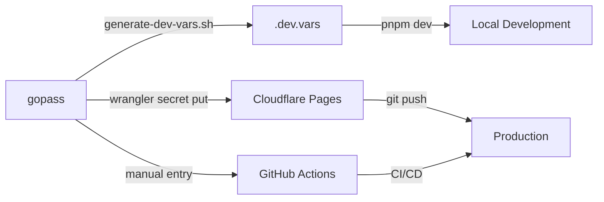

# Environment Variables Audit

**Last Updated**: October 8, 2025
**Purpose**: Consolidated source of truth for all environment variables and secrets

## Summary

This project uses environment variables in **three contexts**:
1. **Local development** (`.dev.vars`)
2. **Cloudflare Pages production** (via Cloudflare Dashboard)
3. **GitHub Actions CI/CD** (repository secrets)

All secrets are stored in **gopass** as the authoritative source and should never be committed to git.

## 📁 File Locations

| File | Purpose | Committed to Git? | Source |
|------|---------|-------------------|--------|
| `.dev.vars` | Local development | ❌ No (gitignored) | Generated from gopass |
| `.dev.vars.example` | Template | ✅ Yes | Manual |
| `.env.example` | Legacy template | ✅ Yes | Manual |
| `ENVIRONMENT.md` | Documentation | ✅ Yes | Manual |
| `SECRETS.md` | Rotation procedures | ✅ Yes | Manual |

## 🔑 Variable Inventory by Service

### GitHub OAuth (Decap CMS)

| Variable | Local (.dev.vars) | Pages Production | Gopass Path |
|----------|-------------------|------------------|-------------|
| `GITHUB_CLIENT_ID` | ✅ Required | ✅ Secret | `github/litecky/oauth/client-id` |
| `GITHUB_CLIENT_SECRET` | ✅ Required | ✅ Secret | `github/litecky/oauth/client-secret` |

**Used by**: `/api/auth`, `/api/callback` (Pages Functions)
**Purpose**: OAuth flow for Decap CMS admin authentication

### Turnstile (Bot Protection)

| Variable | Local (.dev.vars) | Pages Production | Gopass Path |
|----------|-------------------|------------------|-------------|
| `PUBLIC_TURNSTILE_SITE_KEY` | ✅ Test key | ✅ Prod key | `development/turnstile/site-key` (dev)<br>`cloudflare/litecky/turnstile/site-key` (prod) |
| `TURNSTILE_SECRET_KEY` | ✅ Test key | ✅ Secret | `development/turnstile/secret-key` (dev)<br>`cloudflare/litecky/turnstile/secret-key` (prod) |

**Used by**: Contact form (`/api/contact`)
**Purpose**: Spam protection
**Test keys** (always pass):
- Site: `1x00000000000000000000AA`
- Secret: `1x0000000000000000000000000000000AA`

### SendGrid (Email Service)

| Variable | Local (.dev.vars) | Pages Production | Gopass Path |
|----------|-------------------|------------------|-------------|
| `SENDGRID_API_KEY` | ⚠️ Optional | ✅ Secret | `development/sendgrid/api-key` (dev)<br>`sendgrid/api-keys/liteckyeditingservices-key` (prod) |
| `SENDGRID_FROM` | ⚠️ Optional | ✅ Variable | `development/sendgrid/email-from` |
| `SENDGRID_TO` | ⚠️ Optional | ✅ Variable | `development/sendgrid/email-to` |
| `SENDGRID_DOMAIN_ID` | ⚠️ Optional | ✅ Variable | `development/sendgrid/domain-id` |

**Used by**: `/api/contact` (Pages Function), queue consumer worker
**Purpose**: Transactional email delivery
**Note**: Email sending disabled in dev by default (no API key set)

### Cloudflare (Deployment/CI)

| Variable | CI (GitHub Actions) | Gopass Path |
|----------|---------------------|-------------|
| `CLOUDFLARE_API_TOKEN` | ✅ Repository Secret | `cloudflare/api-tokens/initial-project-setup-master` |
| `CF_ACCOUNT_ID` | Public (in code) | `cloudflare/account/id` |
| `CF_ZONE_ID` | Public (in code) | `cloudflare/zones/liteckyeditingservices-com/zone-id` |

**Used by**: GitHub Actions workflows for deployment
**Purpose**: Automated deployments to Cloudflare Pages

## 🗂️ Gopass Structure

```
gopass
├── github/litecky/oauth/
│   ├── client-id              # GitHub OAuth App Client ID
│   └── client-secret          # GitHub OAuth App Client Secret
├── cloudflare/litecky/turnstile/
│   ├── site-key              # Production Turnstile site key
│   └── secret-key            # Production Turnstile secret
├── development/turnstile/
│   ├── site-key              # Test key (1x00000000000000000000AA)
│   └── secret-key            # Test secret (1x0000000000000000000000000000000AA)
├── development/sendgrid/
│   ├── api-key               # Test/dev SendGrid API key
│   ├── email-from            # Dev sender address
│   ├── email-to              # Dev recipient
│   └── domain-id             # SendGrid domain ID
├── sendgrid/api-keys/
│   ├── liteckyeditingservices-key    # Production API key
│   ├── liteckyeditingservices-name   # Key name/description
│   └── liteckyeditingservices-permissions  # Key permissions
└── cloudflare/
    ├── account/id            # Account ID: 13eb584192d9cefb730fde0cfd271328
    ├── api-tokens/initial-project-setup-master  # API token for deployments
    └── zones/liteckyeditingservices-com/
        ├── account-id
        ├── name
        └── zone-id          # Zone ID: a5e7c69768502d649a8f2c615f555eca
```

## 📋 How to Use

### Local Development Setup

1. **Generate .dev.vars from gopass**:
   ```bash
   ./scripts/generate-dev-vars.sh
   ```

2. **Or manually create**:
   ```bash
   cp .dev.vars.example .dev.vars
   # Edit and fill in values from gopass
   ```

3. **Start dev server**:
   ```bash
   pnpm dev
   # .dev.vars is automatically loaded by Wrangler
   ```

### Production Setup (Cloudflare Pages)

**Via Wrangler CLI**:
```bash
# Set a secret
echo "value" | pnpm wrangler pages secret put GITHUB_CLIENT_SECRET --project-name=liteckyeditingservices

# Set from gopass
gopass show -o github/litecky/oauth/client-secret | pnpm wrangler pages secret put GITHUB_CLIENT_SECRET --project-name=liteckyeditingservices
```

**Via Cloudflare Dashboard**:
1. Go to Pages project → Settings → Environment variables
2. Choose Production environment
3. Add variable (public) or secret (encrypted)

### CI/CD Setup (GitHub Actions)

1. Go to repository → Settings → Secrets and variables → Actions
2. Add repository secrets:
   - `CLOUDFLARE_API_TOKEN` (from gopass)

## 🔄 Syncing Process



## ⚠️ Common Issues

### "Missing GITHUB_CLIENT_ID" in local dev
**Solution**: Ensure `.dev.vars` exists and has the credentials. Restart dev server.

### Config.yml 404 error
**Solution**: Dev server not running. Run `pnpm dev` and wait for startup.

### OAuth fails in production
**Solution**:
1. Verify secrets are set in Cloudflare Pages dashboard
2. Check GitHub OAuth App callback URL is `https://www.liteckyeditingservices.com/api/callback`

### Emails not sending in dev
**Solution**: This is intentional. Uncomment `SENDGRID_API_KEY` in `.dev.vars` to enable.

## 📚 Related Documentation

- [ENVIRONMENT.md](../ENVIRONMENT.md) - Full variable matrix
- [SECRETS.md](../SECRETS.md) - Secret rotation procedures
- [CLOUDFLARE.md](../CLOUDFLARE.md) - Infrastructure details
- [scripts/generate-dev-vars.sh](../scripts/generate-dev-vars.sh) - Auto-generation script

## 🔐 Security Best Practices

1. **Never commit secrets** - All sensitive values in `.dev.vars` are gitignored
2. **Use gopass** - Single source of truth for credentials
3. **Rotate regularly** - Follow procedures in SECRETS.md
4. **Minimal permissions** - API keys should have least-privilege scopes
5. **Test keys in dev** - Use Turnstile/SendGrid test keys locally
6. **Separate environments** - Different credentials for dev/preview/production

## ✅ Validation Checklist

- [ ] `.dev.vars` exists and is populated from gopass
- [ ] `.dev.vars` is listed in `.gitignore`
- [ ] All required secrets set in Cloudflare Pages (Production)
- [ ] GitHub Actions has `CLOUDFLARE_API_TOKEN` secret
- [ ] GitHub OAuth App callback URL updated
- [ ] Test OAuth flow locally: http://localhost:4321/admin/
- [ ] Test OAuth flow in production: https://www.liteckyeditingservices.com/admin/
